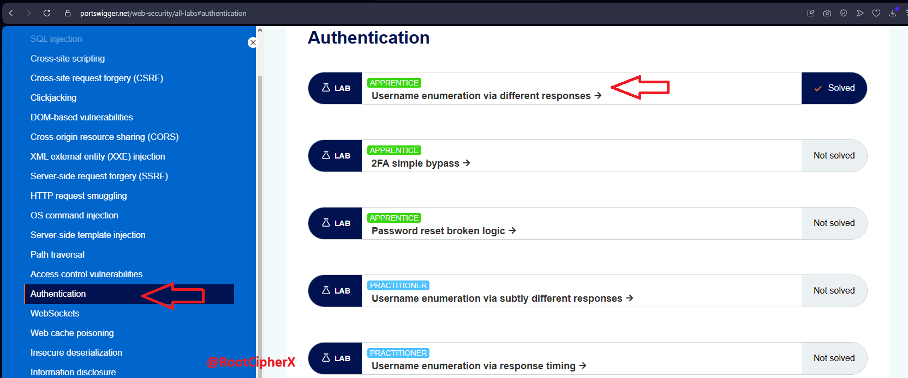
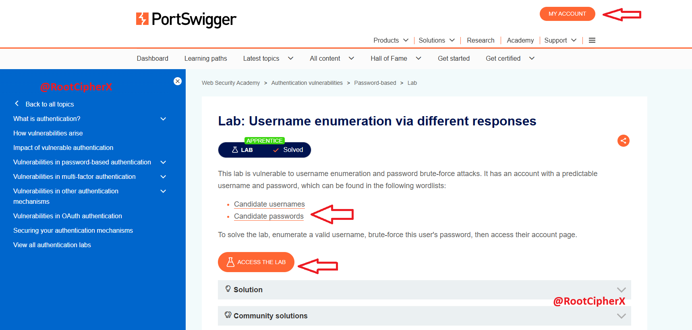
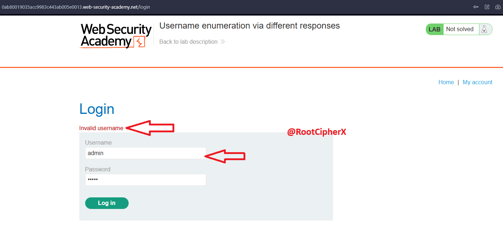
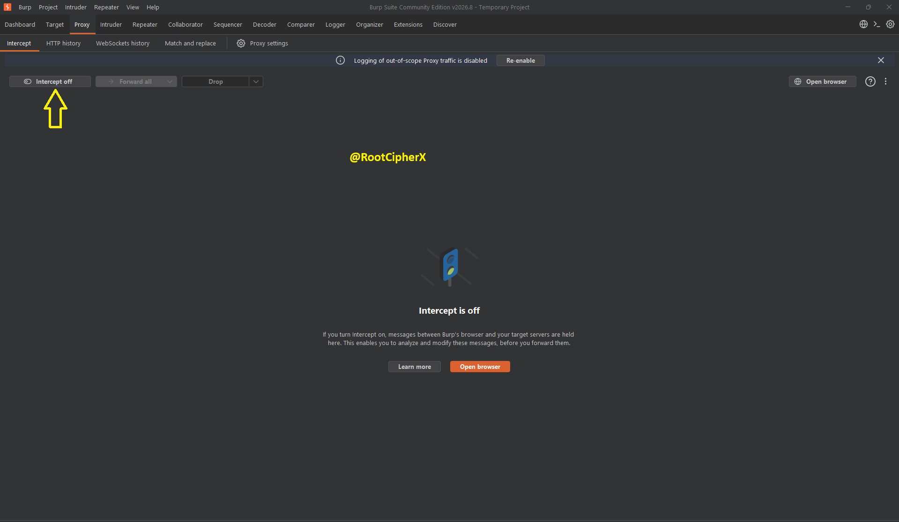
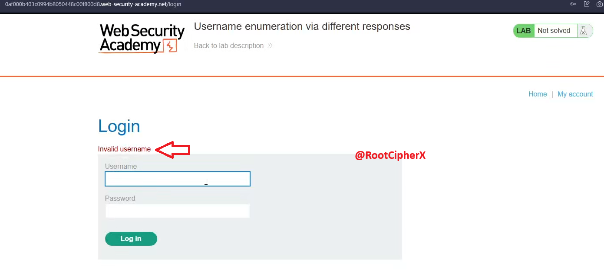
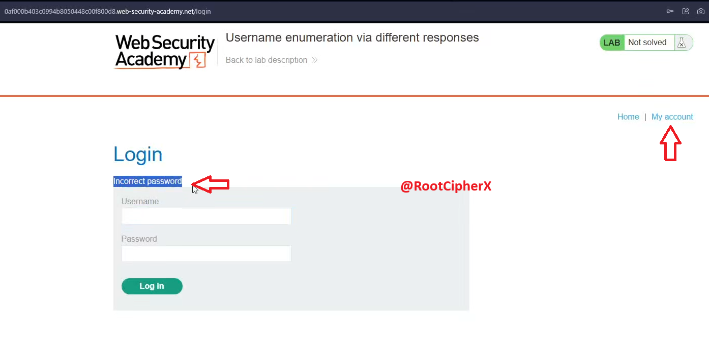
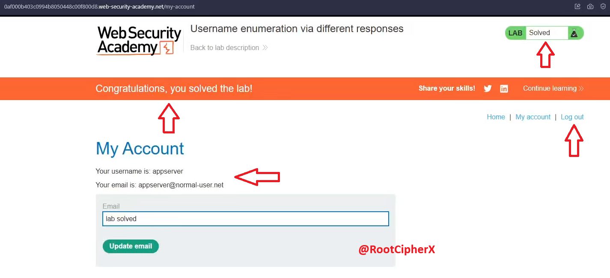

# 🎯 Web Security: Username Enumeration & Authentication Brute-Force via Different Responses

## 📖 Table of Contents
- [Introduction to Authentication Vulnerabilities](#-introduction-to-authentication-vulnerabilities)
- [Project Overview](#-project-overview)
- [Objective](#-objective)
- [Lab Specifications & Target Environment](#️-lab-specifications--target-environment)
- [Technical Attack Methodology](#-technical-attack-methodology)
  - [Phase 1: Target Reconnaissance & Error Differential Analysis](#phase-1-target-reconnaissance--error-differential-analysis)
  - [Phase 2: Traffic Interception & Baseline Verification (Repeater)](#phase-2-traffic-interception--baseline-verification-repeater)
  - [Phase 3: Automated Username Enumeration (Intruder Sniper Attack)](#phase-3-automated-username-enumeration-intruder-sniper-attack)
  - [Phase 4: Response Length Analysis & Valid Account Confirmation](#phase-4-response-length-analysis--valid-account-confirmation)
  - [Phase 5: Password Brute-Forcing & Credential Recovery](#phase-5-password-brute-forcing--credential-recovery)
  - [Phase 6: Session Verification & Lab Exploitation](#phase-6-session-verification--lab-exploitation)
- [Vulnerability Remediation & Defensive Engineering](#-vulnerability-remediation--defensive-engineering)
- [Ethical Guidelines & Disclaimer](#️-ethical-guidelines--disclaimer)

---

## 🛑 Introduction to Authentication Vulnerabilities
Authentication mechanisms are the perimeter gates of web applications. When an authentication service exposes subtle behavioral differences—such as unique error messages, differing HTTP status codes, response length discrepancies, or cryptographic execution time variations—it introduces an information disclosure vulnerability known as **Username Enumeration**.

Adversaries leverage enumeration flaws to split a complex brute-force problem into two distinct, trivial stages:
1. Validating active, registered usernames across the enterprise.
2. Directing dictionary or credential-stuffing attacks solely against confirmed accounts.

## 📌 Project Overview
This repository documents the identification and exploitation of an authentication response differential flaw in the PortSwigger Web Security Academy lab **"Username enumeration via different responses"**[cite: 63, 64]. Using **Burp Suite Community Edition**, the engagement demonstrates traffic interception, HTTP request disassembly, automated fuzzing using Burp Intruder's **Sniper** attack type, response length anomaly detection, and full account compromise[cite: 67, 70, 74, 79, 82].

## 🎯 Objective
To systematically enumerate a valid application username from a candidate wordlist by analyzing HTTP response length variations and error banners, followed by executing a password brute-force attack to obtain unauthorized access to the victim's account dashboard[cite: 64, 79, 82].

## 🛠️ Lab Specifications & Target Environment
*   **Platform:** PortSwigger Web Security Academy (Apprentice Level)[cite: 63, 64]
*   **Vulnerability Classification:** CWE-204 (Observable Response Discrepancy) / OWASP A07:2021-Identification and Authentication Failures
*   **Tooling:** Burp Suite Community Edition (v2026.8)[cite: 67]
*   **Protocol:** HTTP/2 over TLS[cite: 62, 70]
*   **Target Vector:** `POST /login` form parameter manipulation[cite: 62, 70]
*   **Payload Execution Mode:** Intruder Sniper Attack[cite: 74, 84]

---

## 🚀 Technical Attack Methodology

### Phase 1: Target Reconnaissance & Error Differential Analysis

Navigated to the PortSwigger Web Security Academy dashboard and selected the target lab: **Username enumeration via different responses**[cite: 63].
<br>



Reviewed the target scope, constraints, and provided attack wordlists (**Candidate usernames** and **Candidate passwords**) before accessing the live instance[cite: 64].
<br>



Accessed the lab web application ("We Like to Blog") and navigated to the authentication interface by selecting **My account** in the primary navigation header[cite: 65].
<br>


Submitted arbitrary baseline credentials (`admin` / `admin`) into the login form to observe application error handling[cite: 66, 70]. The application rendered an explicit notification: **"Invalid username"**[cite: 66]. This confirmed that the server validates the existence of the username before checking the password, creating an information disclosure vector[cite: 66, 80].
<br>



---

### Phase 2: Traffic Interception & Baseline Verification (Repeater)

Launched Burp Suite Community Edition and verified that the local proxy listener was running[cite: 67].
<br>



Toggled **Intercept is on** within the **Proxy** tab to capture browser traffic[cite: 68].
<br>


Switched to the browser and re-submitted test credentials into the login interface to trigger the authentication request[cite: 69].
<br>



Burp Proxy intercepted the raw `POST /login HTTP/2` request, containing the session cookie and form body payload: `username=admin&password=admin`[cite: 70].
<br>


Right-clicked inside the request window and selected **Send to Repeater** (`Ctrl+R`) to analyze server responses without browser interaction[cite: 71].
<br>


In the **Repeater** tab, clicked **Send** to inspect the response body[cite: 62]. The server returned `HTTP/2 200 OK` containing `<p class="is-warning">Invalid username</p>`, establishing our baseline error condition[cite: 62].
<br>


---

### Phase 3: Automated Username Enumeration (Intruder Sniper Attack)

Right-clicked the verified request inside Repeater and selected **Send to Intruder** (`Ctrl+I`) to prepare automated dictionary fuzzing[cite: 73].
<br>


Configured the attack parameters in Intruder:
*   **Attack Type:** Selected **Sniper attack** (targets a single position using one payload set)[cite: 74].
*   **Payload Position:** Cleared all default positions and defined a single insertion marker around the username value: `username=§admin§&password=admin`[cite: 74].
<br>


Opened the provided **Authentication lab usernames** candidate list and copied all 101 entries to the clipboard[cite: 75, 76].
<br>


Navigated to the **Payloads** side panel, verified the payload type was set to **Simple list**, pasted the candidate usernames, and launched the fuzzing job via **Start attack**[cite: 76].
<br>


Acknowledged the Burp Suite Community Edition dialogue regarding request throttling[cite: 77].
<br>


---

### Phase 4: Response Length Analysis & Valid Account Confirmation

Monitored the active Intruder attack table, tracking status codes, response length, and individual packet round-trip times[cite: 78].
<br>


Sorted the finished results by the **Length** column:
*   **Negative Baseline:** 100 candidate usernames returned `HTTP 200 OK` with a uniform response length of **3352** bytes (displaying `"Invalid username"`)[cite: 79].
*   **Positive Anomaly:** Request #78 containing the payload **`appserver`** returned `HTTP 200 OK` with a length of **3354** bytes (a distinct 2-byte delta)[cite: 79].
<br>


Sent a verification request for `username=appserver` to Repeater[cite: 80]. The rendered response confirmed the behavioral discrepancy: the application returned **"Incorrect password"** instead of "Invalid username"[cite: 80].
<br>


Re-verified the finding via the web browser: submitting `appserver` confirmed the presence of the account on the system[cite: 81].
<br>



---

### Phase 5: Password Brute-Forcing & Credential Recovery

Having confirmed the valid username, adjusted the Intruder configuration to crack the password:
*   **Static Username:** Locked `username=appserver`[cite: 72].
*   **Dynamic Payload Position:** Moved the Sniper markers to target the password parameter: `password=§admin§`[cite: 72].
<br>


Accessed the PortSwigger **Authentication lab passwords** wordlist and copied all candidate entries[cite: 83].
<br>


Cleared previous payloads, pasted the candidate password list into Intruder, and clicked **Start attack**[cite: 84].
<br>


Analyzed the attack results table:
*   **Failed Passwords:** Returned `HTTP 200 OK` with a length of **3354** bytes (displaying `"Incorrect password"`)[cite: 85].
*   **Successful Password:** Request #44 using the payload **`andrew`** returned an **`HTTP/2 302 Found`** redirect with a length of **191** bytes, redirecting to `/my-account` and setting an authenticated session cookie[cite: 85].
<br>


---

### Phase 6: Session Verification & Lab Exploitation

Entered the recovered credentials into the application login portal:
*   **Username:** `appserver`[cite: 82]
*   **Password:** `andrew`[cite: 85]

The application authenticated the session, redirecting to the user portal (`appserver@normal-user.net`) and solving the lab[cite: 82].
<br>



---

## 🛡️ Vulnerability Remediation & Defensive Engineering

To prevent automated credential attacks and username enumeration:

*   **Generic Error Messaging:** The application should return uniform responses regardless of failure cause. Avoid `"Invalid username"` or `"Incorrect password"`; instead, use:
    ```text
    "Invalid username or password."
    ```
*   **Consistent Response Profiles:** Ensure response body length, HTTP status codes, and server execution times remain identical for both non-existent users and invalid password attempts.
*   **Account Lockout & Exponential Backoff:** Implement progressive delays after repeated failed login attempts from a given IP address or against a target account to degrade the viability of automated tools like Burp Intruder.
*   **Multi-Factor Authentication (MFA):** Mandate MFA across all administrative and user portals to render recovered passwords insufficient for unauthorized access.

---

## ⚖️ Ethical Guidelines & Disclaimer
This penetration testing exercise was conducted entirely within PortSwigger Web Security Academy's dedicated, authorized educational training environment[cite: 63, 64]. The methodologies demonstrated are intended solely for defensive application security training, secure software development education, and authorized security assessments.
